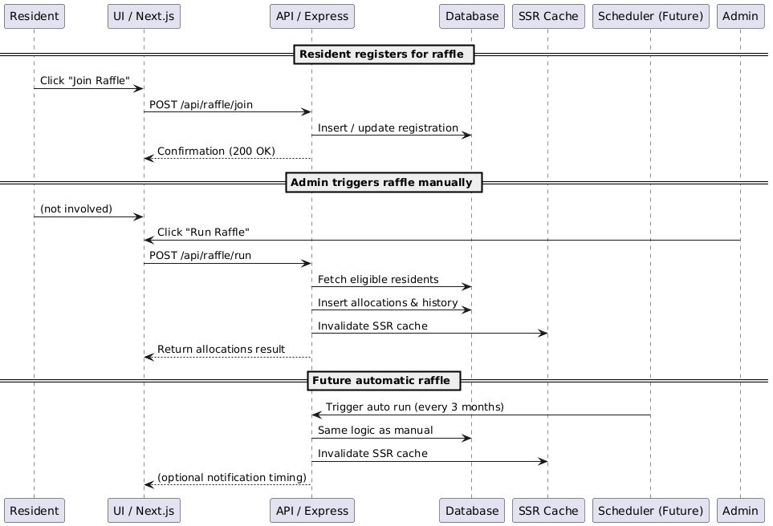

# System Architecture Overview

The Parking Management System is designed as a modular, scalable web application that ensures fair and automated parking spot allocations within a residential complex. It follows a three-tier architecture with clear separation of concerns between presentation, application logic, and data persistence.

## Architecture Flow

```
User → Vercel (Next.js SSR) → Render (Express API) → Supabase (PostgreSQL + Auth)
```

---

## Architectural Drivers

| Category            | Driver         | Description                                                         |
| ------------------- | -------------- | ------------------------------------------------------------------- |
| **Primary Goal**    | Fairness       | Guarantee equitable parking spot rotations every 3 months.          |
| **Scalability**     | Growth         | Support multiple buildings or complexes in future iterations.       |
| **Maintainability** | Code structure | Clear modularity between frontend, backend, and persistence layers. |
| **Deployability**   | Simplicity     | Free-tier deployment on Vercel (frontend) and Render (backend).     |
| **Reliability**     | Data integrity | PostgreSQL (Supabase) ensures relational consistency.               |

---

## System Layers

| Layer               | Technology               | Purpose                                                                |
| ------------------- | ------------------------ | ---------------------------------------------------------------------- |
| **Frontend**        | Next.js (React) with SSR | Provides user interfaces for Residents and Admins with authentication. |
| **Backend API**     | Node.js with Express     | Handles raffle logic, resident management, and JWT verification.       |
| **Authentication**  | Supabase Auth            | Email/password authentication with SSR support and JWT tokens.         |
| **Database**        | PostgreSQL (Supabase)    | Stores residents, parking spots, allocations, and historical records.  |
| **Cache (Active)**  | Next.js SSR caching      | In-memory caching during server-side rendering.                        |
| **Cache (Planned)** | Redis (Upstash)          | Distributed cache layer planned for v1.1.                              |
| **Hosting**         | Vercel + Render          | Automatic deployments with PR-based preview environments.              |

---

## C4 Architecture Diagrams

### Level 1: System Context

  
Shows how the system interacts with external actors (Residents, Admins) and cloud services (Supabase, Render, Vercel).

### Level 2: Container Diagram

  
Outlines the high-level containers (Frontend, API, Database, Cache) and their communication flows.

### Level 3: Component Diagram

  
Illustrates internal structures — how Next.js components, hooks, and API endpoints map to Express services and controllers.

### Level 4: Sequence Diagram (Raffle Flow)

  
Depicts the interaction between system components during a raffle cycle, from user registration to allocation update.

Related: [Security](security.md) | [Performance](performance.md)

---

## Architectural Principles

1. **Separation of Concerns** - Each layer (frontend, backend, database) has clear responsibilities.
2. **Simplicity and Cost-efficiency** - Deployments use free-tier platforms to balance scalability and affordability.
3. **Transparency in Allocation** - All raffle results and histories are persisted for auditability.
4. **Extendability** - Modular architecture supports new features (e.g., license plate detection).
5. **Performance via SSR Caching** - SSR caching active in Next.js with in-memory strategy. Redis integration planned for v1.1.

---

## Future Evolution

| Goal                      | Evolution Path                                            |
| ------------------------- | --------------------------------------------------------- |
| Multi-building support    | Add `Building` table and extend allocation logic.         |
| License Plate Recognition | Integrate an ML pipeline (delegated to AI/DevOps team).   |
| Event-driven updates      | Replace REST calls with WebSockets or Server-Sent Events. |
| Automated raffle rotation | Schedule `/api/raffle/run` trigger every 3 months.        |
| Centralized cache layer   | Introduce Redis (Upstash) for shared caching and scaling. |

---

## Scalability & Future Integration Hooks

- **Modular service boundaries** — Backend structured to easily integrate:
    - `LPR Ingestion API` for real-time license plate recognition.
    - `Notification Service` for resident/admin alerts.

- **Database extendability** — Schema designed for easy inclusion of new entities (`Vehicles`, `AccessEvents`, `Buildings`).

- **Event-driven readiness** — REST endpoints can evolve into asynchronous handlers using WebSockets, queues, or background schedulers.

- **Multi-building scaling** — Use of `building_id` fields enables multi-tenant or multi-complex deployments.

- **Infrastructure evolution** — Free-tier hosting (Vercel + Render) can later migrate to AWS ECS or Google Cloud Run with minimal changes.

---

## Delegation & Team Scalability Plan

| Area                          | Ownership            | Future Responsibility                            |
| ----------------------------- | -------------------- | ------------------------------------------------ |
| **Core raffle logic**         | Backend team         | Maintain fairness, optimize DB queries.          |
| **SSR caching layer**         | Frontend team        | Maintain cache service, later integrate Redis.   |
| **License Plate Recognition** | AI/ML team           | Model training, edge image processing.           |
| **Notifications & Webhooks**  | Full-stack developer | Integrate email/SMS or Slack alerts.             |
| **Infra & CI/CD**             | DevOps team          | Scale Render/Vercel deploys or migrate to Cloud. |
