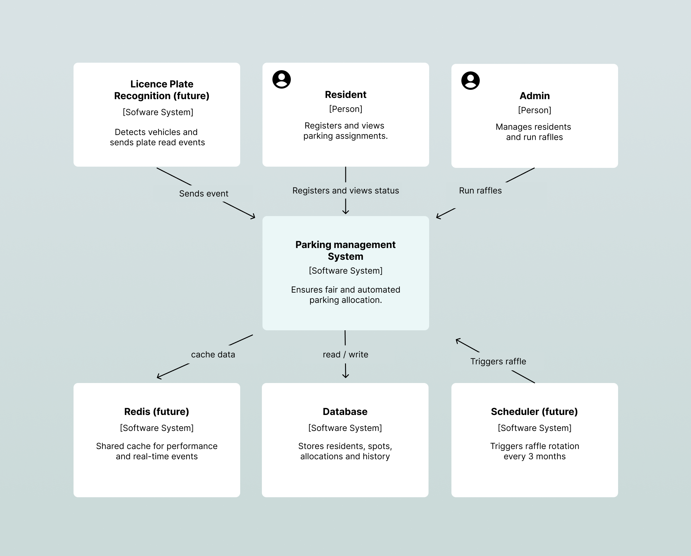
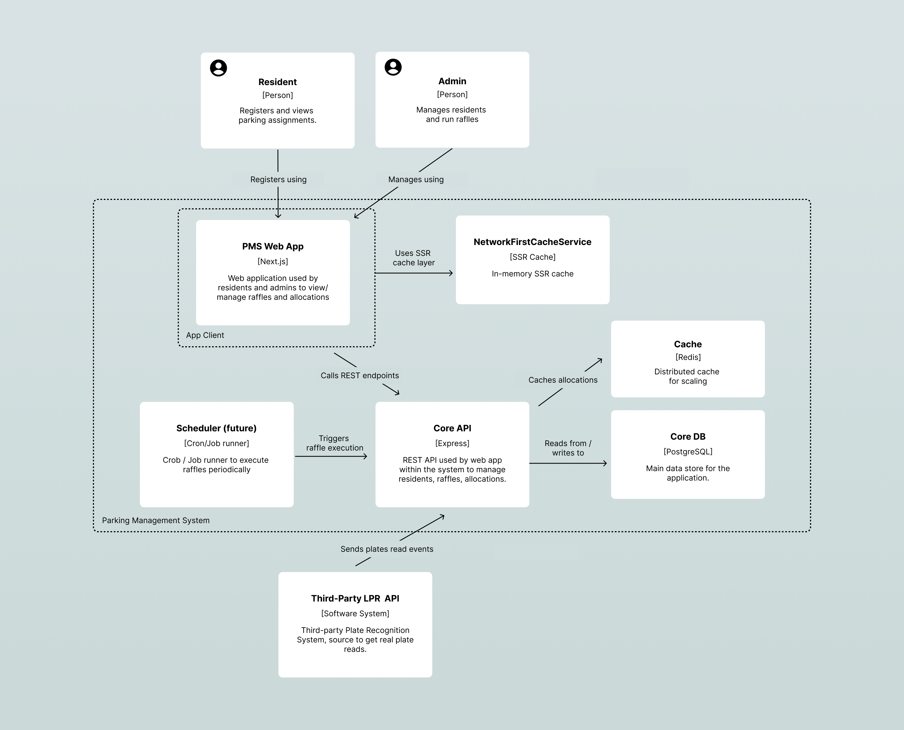

# System Architecture Documentation

This document provides a detailed architectural view of the **Parking Management System**, following the C4 model — from high-level context to low-level component and sequence flows.

The goal is to demonstrate architectural clarity, scalability, and readiness for future feature expansion (e.g., multi-building support and license plate recognition).

---

## Level 1: System Context

**Purpose:**  
Shows how the system interacts with key external actors and cloud services.

**Actors**

- **Resident:** Registers for the parking raffle and views current allocations.
- **Admin:** Manages residents, parking spots, and triggers raffles.

**External Systems**

- **Supabase:** Cloud-hosted PostgreSQL database used for persistence.
- **Render:** Backend hosting (Express API).
- **Vercel:** Frontend hosting (Next.js).

**Key Relationships**

- Residents and Admins access the **Frontend (Next.js)** via web browsers.
- The Frontend communicates with the **Backend API (Express)** via REST.
- The Backend stores data and retrieves records from **Supabase**.
- The Frontend uses **SSR caching** to optimize repeated API requests.

---

## Level 2: Container Diagram

**Purpose:**  
Defines the major technology containers, their roles, and how they communicate.

| Container                | Technology                    | Responsibility                                                                            |
| ------------------------ | ----------------------------- | ----------------------------------------------------------------------------------------- |
| **Frontend**             | Next.js (React)               | Renders the Resident and Admin dashboards, handles user actions, and manages SSR caching. |
| **Backend API**          | Node.js + Express             | Exposes REST endpoints for raffle logic, resident management, and allocations.            |
| **Database**             | Supabase (PostgreSQL)         | Stores residents, parking spots, allocation records, and histories.                       |
| **Cache (SSR)**          | `NetworkFirstCacheService`    | Handles SSR caching of API responses during page generation.                              |
| **Cache (Future)**       | Redis (Upstash)               | Planned distributed cache for scalability and real-time updates.                          |
| **Scheduler (Future)**   | Cron or AWS Lambda            | Planned service to automate raffle execution every 3 months.                              |
| **LPR Service (Future)** | License Plate Recognition API | Future module for real-time vehicle event ingestion.                                      |

**Communication Flow**

1. The **Resident** uses the **Frontend** (Next.js) to register or check status.
2. The **Frontend** communicates with the **Backend API** (Express) through REST.
3. The **Backend** reads/writes from **Supabase** and uses **SSR cache** to improve response times.
4. In the future, **Redis** will centralize caching for multiple replicas.

---

## Level 3: Component Diagram

**Purpose:**  
Explains how internal modules within the Frontend and Backend interact.

### **Frontend Components**

| Component                    | Description                                    |
| ---------------------------- | ---------------------------------------------- |
| **DashboardPage**            | Displays raffle info and resident allocations. |
| **RaffleRegistration**       | Allows residents to join raffles.              |
| **NetworkFirstCacheService** | Caches API data during SSR.                    |
| **ApiClient**                | Fetches backend data via REST endpoints.       |

### **Backend Components**

| Component                     | Description                                                    |
| ----------------------------- | -------------------------------------------------------------- |
| **RaffleController**          | Core business logic for raffle generation and fairness checks. |
| **ResidentController**        | CRUD operations for residents and their allocation history.    |
| **SchedulerHandler (Future)** | Cron/Job trigger for automated raffles.                        |
| **LPRController (Future)**    | Endpoint for license plate recognition events.                 |

---

## Level 4: Sequence Diagram (Raffle Flow)

**Purpose:**  
Shows the main event flow for the raffle process.

1. **Resident** registers for the raffle through the Frontend.
2. **Frontend** sends a POST request to `/api/raffle/join`.
3. **Backend** validates the resident, logs participation, and stores in DB.
4. **Admin** triggers the raffle manually from the dashboard.
5. **Backend** executes allocation algorithm and updates records in Supabase.
6. **Frontend** revalidates cache via SSR for updated results.
7. (Future) **Scheduler** will automate raffle triggering every 3 months.

---

## Performance & Scalability Considerations

- **SSR Cache Layer** — reduces backend calls by caching API data in Next.js during rendering.
- **Database Indexing** — indexes on `resident_id` and `allocated_at` for quick lookups.
- **Asynchronous Operations** — raffle runs handled asynchronously to avoid blocking UI.
- **Future Redis Integration** — migrate SSR cache to shared Redis for distributed scaling.
- **Cloud Flexibility** — current deployment (Vercel + Render) can easily migrate to AWS ECS or Cloud Run.

---

## Summary

This architecture balances **simplicity, scalability, and cost-efficiency**.  
It demonstrates senior-level architectural thinking by combining:

- Lightweight but modular design.
- Clear scalability path (multi-building, real-time updates).
- Thoughtful use of caching and delegation.
- Documented readiness for future AI and automation integrations.

---

**Next:**  
Proceed to [`scalability-and-future.md`](./scalability-and-future.md) for extended documentation on growth strategy and delegation planning.
