# Changesets Guide

This document explains how to use Changesets for version management and automated releases in this project.

---

## What are Changesets?

Changesets are a way to declare which packages have changed and how they've changed since the last release. They help automate:

- **Version bumping** (semver: major, minor, patch)
- **Changelog generation**
- **Release notes creation**

---

## 🔄 Workflow Overview

```mermaid
graph LR
    A[Make Changes] --> B[Create Changeset]
    B --> C[Create PR]
    C --> D{Has Changeset?}
    D -->|No| E[❌ PR Blocked]
    D -->|Yes| F[✅ CI Passes]
    F --> G[Merge to main]
    G --> H[Auto Version Bump]
    H --> I[Generate Release Notes]
    I --> J[Deploy to Vercel]
```



---

## 📝 How to Create a Changeset

### Step 1: Make Your Changes

Work on your feature/fix as usual.

### Step 2: Create a Changeset

```bash
npm run change:add
```

This will prompt you with:

```
🦋  Which packages would you like to include?
> [x] frontend

🦋  What kind of change is this for frontend?
  ○ major (breaking changes)
  ○ minor (new features)
  ● patch (bug fixes)

🦋  Please enter a summary for this change
```

### Step 3: Write a Clear Summary

Be specific and user-focused:

✅ **Good:**

```
Added pagination to parking allocation table
```

❌ **Bad:**

```
Updated Table component
```

### Step 4: Commit the Changeset

The changeset file will be created in `.changeset/` directory:

```bash
git add .changeset/*.md
git commit -m "feat: add pagination to allocation table"
```

---

## Changeset Types

| Type      | Version Bump  | When to Use                        |
| --------- | ------------- | ---------------------------------- |
| **patch** | 1.0.0 → 1.0.1 | Bug fixes, minor improvements      |
| **minor** | 1.0.0 → 1.1.0 | New features, non-breaking changes |
| **major** | 1.0.0 → 2.0.0 | Breaking changes, API changes      |

---

## 🚫 PR Blocking Rule

The CI/CD pipeline **blocks PRs without changesets**:

```yaml
❌ No changeset found!
Please run 'npm run change:add' to create a changeset.
```

This ensures:

- All changes are documented
- Proper versioning is maintained
- Release notes are comprehensive

---

## 🤖 Automated Release Process

When you merge to `main`:

1. **Changeset Detection** - CI reads all `.changeset/*.md` files
2. **Version Bump** - Updates `package.json` versions
3. **Changelog Update** - Generates/updates `CHANGELOG.md`
4. **Commit** - Auto-commits with message: `chore: version bump and release notes`
5. **Deploy** - Triggers Vercel deployment

---

## Available Scripts

| Script          | Command                    | Purpose                  |
| --------------- | -------------------------- | ------------------------ |
| Add changeset   | `npm run change:add`       | Create a new changeset   |
| Empty changeset | `npm run change:add:empty` | Skip version bump (rare) |
| Apply versions  | `npm run change:version`   | Manually bump versions   |
| Generate notes  | `npm run release:notes`    | Create release notes     |

---

## 📁 Changeset File Example

After running `npm run change:add`, a file like `.changeset/quick-foxes-sing.md` is created:

```markdown
---
'frontend': patch
---

Fixed pagination bug in parking allocation table
```

---

## 🧪 Testing the Workflow

### Local Testing

```bash
# 1. Create a changeset
npm run change:add

# 2. View what will be bumped
npx changeset status

# 3. Preview version changes (dry run)
npx changeset version --dry-run
```

### CI/CD Testing

1. Create a test branch
2. Make a change
3. Create a changeset
4. Open a PR → should pass ✅
5. Remove the changeset
6. Push again → should fail ❌

---

## 🎨 Changelog Format

Generated changelogs follow this format:

```markdown
# frontend

## 1.2.0

### Minor Changes

- abc1234: Added pagination to parking allocation table
- def5678: Implemented dark mode support

### Patch Changes

- ghi9012: Fixed navigation bug on mobile
```

---

## 🔐 Required GitHub Secrets

The workflow requires:

- `GITHUB_TOKEN` - Auto-provided by GitHub Actions
- `VERCEL_DEPLOY_HOOK_URL` - For deployment trigger

---

## Benefits

| Benefit          | Description                              |
| ---------------- | ---------------------------------------- |
| **Consistency**  | Every PR documents changes               |
| **Automation**   | Version bumps happen automatically       |
| **Transparency** | Clear release history for stakeholders   |
| **Safety**       | Prevents accidental deploys without docs |
| **Traceability** | Links changes to versions                |

---

## 🧭 Best Practices

### ✅ Do

- Write clear, user-focused summaries
- Create changesets for every PR
- Use appropriate version types (patch/minor/major)
- Review generated changelogs before releases

### ❌ Don't

- Create empty changesets unnecessarily
- Use vague descriptions like "fixes" or "updates"
- Skip changesets (CI will block you anyway)
- Manually edit version numbers in `package.json`

---

## 🆘 Troubleshooting

### "No changeset found" Error

**Problem:** CI blocks your PR

**Solution:**

```bash
npm run change:add
git add .changeset/*.md
git commit -m "chore: add changeset"
git push
```

### Changeset Not Detected

**Problem:** Created changeset but CI still fails

**Solution:** Ensure the file is in `.changeset/` and committed:

```bash
ls -la .changeset/
git status
```

### Wrong Version Bump

**Problem:** Version bumped incorrectly

**Solution:** Edit the changeset file before merging:

```bash
# Edit .changeset/[filename].md
# Change "patch" to "minor" or "major"
```

---

## 📚 References

- [Changesets Documentation](https://github.com/changesets/changesets)
- [Semantic Versioning](https://semver.org/)
- [GitHub Actions - Changesets Action](https://github.com/changesets/action)

---

**Last updated:** 2025-10-12
