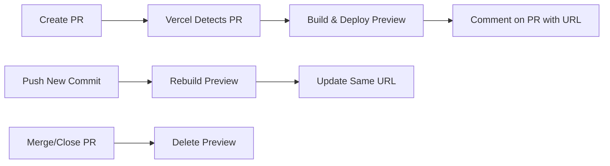

# Vercel Preview Deployments

Vercel automatically creates preview deployments for every Pull Request, allowing teams to test changes in a live environment before merging to production.

---

## What are Preview Deployments?

Preview deployments are **temporary, isolated environments** that Vercel creates automatically for each PR. They provide:

- ✅ Live URL to test changes
- ✅ Isolated from production
- ✅ Auto-updated on each commit
- ✅ Deleted after PR closes
- ✅ Shareable with stakeholders

---

## 🔄 Automatic Workflow



---

## How It Works

### 1. **Open a Pull Request**

```bash
git checkout -b feat/new-feature
# ... make changes ...
git push origin feat/new-feature
# Open PR on GitHub
```

### 2. **Vercel Detects and Deploys**

Within seconds, Vercel:

- Detects the new PR
- Builds the application
- Deploys to a unique URL

### 3. **Bot Comments on PR**

The Vercel bot automatically posts a comment like:

```
✅ Preview deployment ready!

🔍 Preview: https://parking-management-system-frontend-abc123-manucomi.vercel.app
📝 Inspect: https://vercel.com/manucomi/parking-management-system/abc123
```

### 4. **Auto-Update on New Commits**

Every time you push new changes:

- Vercel rebuilds the preview
- Same URL gets updated
- New comment posted with build status

### 5. **Cleanup After Merge**

When PR is merged or closed:

- Preview deployment is deleted
- Resources are freed
- Links become inactive

---

## 🎨 Preview URL Format

```
https://parking-management-system-frontend-[git-branch-hash]-[owner].vercel.app
```

**Example:**

```
https://parking-management-system-frontend-pr-second-attempt-version-bump-abc123.vercel.app
```

---

## Benefits for Development

### 1. **Visual Code Review**

Reviewers can:

- See UI changes in action
- Test interactions and flows
- Verify responsive design
- Check accessibility

### 2. **Stakeholder Feedback**

Share preview link with:

- Product managers
- Designers
- QA team
- Non-technical stakeholders

### 3. **Parallel Testing**

Test multiple PRs simultaneously:

- Each PR has its own isolated environment
- No conflicts between features
- Safe experimentation

### 4. **Confidence Before Merge**

Catch issues early:

- Visual regressions
- Integration problems
- Build errors
- Performance issues

---

## 🔍 Accessing Preview Deployments

### Method 1: GitHub PR Comment

Look for the Vercel bot comment:

```
🔍 Latest commit: abc1234
✅ Preview: Ready
🔗 https://parking-management-[hash].vercel.app
```

### Method 2: GitHub Checks Tab

In the PR:

1. Click "Checks" tab
2. Find "Vercel" deployment
3. Click "Details" → Opens preview

### Method 3: Vercel Dashboard

In Vercel dashboard:

1. Go to project
2. Click "Deployments"
3. Find PR branch
4. Click deployment URL

---

## Best Practices

### ✅ Do:

- **Test before requesting review** - Check your own preview first
- **Share with stakeholders** - Get early feedback
- **Test across devices** - Use preview on mobile/tablet
- **Check console** - Look for errors in browser DevTools
- **Verify env vars** - Ensure preview has correct environment

### ❌ Don't:

- **Rely only on localhost** - Preview shows real deployment behavior
- **Skip preview testing** - Always check before merging
- **Share sensitive data** - Preview URLs are publicly accessible
- **Expect production data** - Preview uses preview environment/database

---

## 🔐 Security Considerations

### Public Access

⚠️ **Preview URLs are publicly accessible** (if you know the URL)

**Implications:**

- Anyone with the link can access the preview
- Don't use production credentials
- Don't display sensitive data
- Use preview/test databases only

### Environment Variables

Vercel automatically uses:

- Preview environment variables
- Not production secrets
- Configure in Vercel dashboard

---

## 🛠️ Configuration

Preview deployments work automatically, but you can customize:

### 1. **Build Settings** (vercel.json)

```json
{
    "buildCommand": "npm run build",
    "devCommand": "npm run dev",
    "framework": "nextjs",
    "installCommand": "npm ci"
}
```

### 2. **Environment Variables**

In Vercel dashboard:

- Set preview-specific env vars
- Separate from production
- Can override per branch

### 3. **Deployment Protection**

Optional settings:

- Password-protect previews
- Restrict by Vercel authentication
- Configure in Vercel dashboard

---

## 📊 Deployment Status

### Build Statuses

| Status          | Meaning          | Action              |
| --------------- | ---------------- | ------------------- |
| ✅ **Ready**    | Build successful | Test the preview    |
| 🔄 **Building** | In progress      | Wait for completion |
| ❌ **Failed**   | Build error      | Check build logs    |
| ⏸️ **Canceled** | Manually stopped | Rebuild if needed   |

---

## 🐛 Troubleshooting

### Preview Not Created

**Possible causes:**

- Vercel GitHub integration not installed
- Build failed (check logs)
- Branch name has special characters
- Vercel project not linked

**Solution:**

1. Check Vercel dashboard for errors
2. Verify GitHub integration is active
3. Check build logs for failures

### Preview Shows Old Code

**Possible causes:**

- Cache not cleared
- Build still in progress
- Browser cache

**Solution:**

1. Hard refresh (Cmd+Shift+R / Ctrl+Shift+R)
2. Check Vercel dashboard for latest deployment
3. Wait for build to complete

### Environment Variables Missing

**Possible causes:**

- Not set in Vercel dashboard
- Only set for production
- Typo in variable name

**Solution:**

1. Go to Vercel → Project Settings → Environment Variables
2. Add variables for "Preview" environment
3. Redeploy

---

## 📚 Additional Resources

- [Vercel Preview Deployments Documentation](https://vercel.com/docs/concepts/deployments/preview-deployments)
- [Vercel GitHub Integration](https://vercel.com/docs/concepts/git/vercel-for-github)
- [Environment Variables Guide](https://vercel.com/docs/concepts/projects/environment-variables)

---

## 🎓 Example Workflow

```bash
# 1. Create feature branch
git checkout -b feat/add-dark-mode

# 2. Make changes
# ... code changes ...

# 3. Commit and push
git add .
git commit -m "feat: add dark mode toggle"
git push origin feat/add-dark-mode

# 4. Open PR on GitHub
# → Vercel automatically:
#    - Builds the app
#    - Deploys to preview URL
#    - Comments on PR with link

# 5. Share preview with team
# Copy URL from Vercel comment
# Send to reviewers/stakeholders

# 6. Push fixes based on feedback
git commit -m "fix: adjust dark mode colors"
git push
# → Vercel automatically rebuilds same preview URL

# 7. Merge when approved
# → Preview deployment deleted
# → Production deployment triggered
```

---

**Last updated:** 2025-10-12
