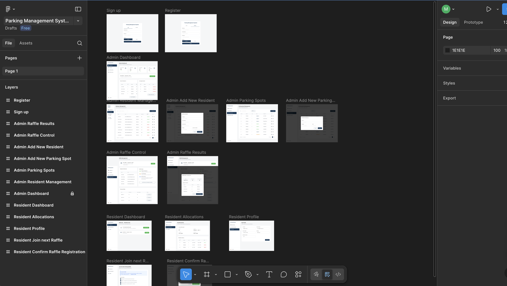

# User Interface Overview

This section illustrates the visual design and user experience of the **Parking Management System**.

The mockups were designed in Figma to represent the main user flows for both **Residents** and **Admins**, following the system architecture defined in the C4 diagrams.

---

## Design Highlights

- **Clean executive dashboard style**.
- **Consistent navigation patterns** for both roles (Resident and Admin).
- **Modular component hierarchy** aligned with React component architecture (cards, tables, modals, banners).
- **Responsive layout** designed for desktop-first with mobile adaptation.

---

## Screens Overview

| Role     | Screen                   | Description                                                                    |
| -------- | ------------------------ | ------------------------------------------------------------------------------ |
| Resident | Login & Registration     | Access point for residents and admins, includes email/password authentication. |
| Resident | Dashboard                | Displays current parking status, next raffle date, and join actions.           |
| Resident | Raffle Registration      | Confirmation of participation in the next parking raffle.                      |
| Admin    | Dashboard                | Summary of metrics (residents, available spots, upcoming raffles).             |
| Admin    | Residents Management     | CRUD interface for resident profiles.                                          |
| Admin    | Parking Spots Management | Table view for managing parking spaces.                                        |
| Admin    | Raffle Control           | Page to run, view, and audit raffles.                                          |

---

## Screenshots

### 1. Admin Dashboard (cover)

### 2. Full System Overview

For the full interactive prototype, visit:
👉 [Figma Prototype](https://www.figma.com/proto/bS8vZPnivOQEnm5VRc4OfO/Parking-Management-System?node-id=3-388)

---

## Design-to-Architecture Mapping

| UI Component    | React/Next.js Component | Data Source           | Notes                                |
| --------------- | ----------------------- | --------------------- | ------------------------------------ |
| Dashboard Cards | `<DashboardCard>`       | REST API `/stats`     | Displays counts and next raffle info |
| Residents Table | `<ResidentsTable>`      | REST API `/residents` | Pagination and search implemented    |
| Raffle Modal    | `<RaffleResultModal>`   | `/raffle/run`         | Triggered when raffle completes      |
| Spot Card       | `<SpotCard>`            | `/spots`              | Shows availability visually          |
| Top Navigation  | `<Header>`              | Client-side context   | Shared across roles                  |

---

## Related Files

- `/docs/architecture/container-diagram.jpeg`
- `/docs/assets/cover.png`
- `/docs/assets/figma-ui.png`
- `/docs/design-doc.md`
